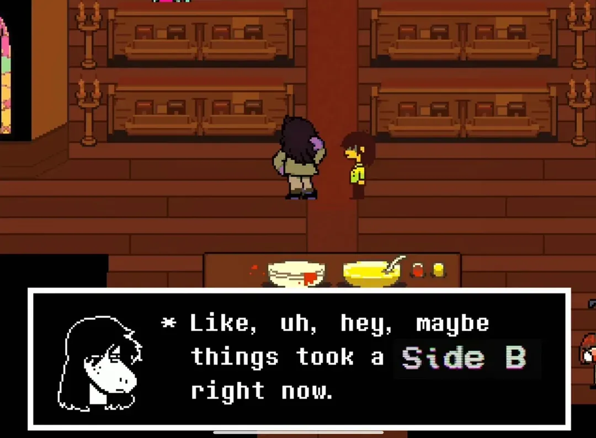

# Side B

Mirror code across Luau repositories, geared for Roblox projects with
a variety of requirements like [Welcome To Hell](https://welcomestohell.com).



## Usage

Install it:

```sh
rokit add teamfireworks/sideb@0.0.0-rc.1
```

Configure it:

```luau
-- .config.luau
return {
	luau = { ... },
	rose = { ... },
	sideb = {
		remote = "https://github.com/welcomestohell/game.git",
		branch = "main",

		directory = "mirror",
		targets = {
			"workplace/kit",
			
			"workspace/core",
			"workspace/libs",
			"workspace/playermodule",

			".zed",
			".vscode",
			".gitattributes",
			".styluaignore",
			"patches",
			"pesde.toml",
			"rokit.toml",
			"selene.toml",
			"stylua.toml",
		},
	}
}
```

Use it:

```sh
# Fetch and mirror code
sideb sync

# Fetch and mirror code, then pushes a git commit
sideb commit

# Fetch mirror from current revision
sideb fetch

# Mirrors code onto targets
sideb apply
```

## License

MIT License.
